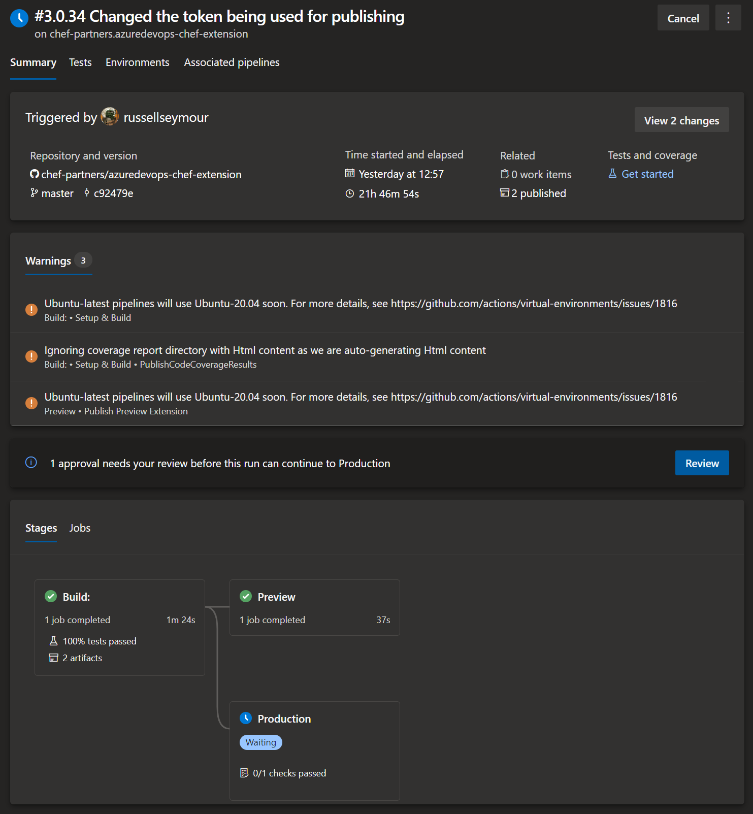



# Deploy

The Azure DevOps (AzDo) Chef Extension is deployed using an AzDo [pipeline file](https://github.com/chef-partners/azuredevops-chef-extension/azure-pipelines.yaml).

The following screen shot shows the process in AzDo.

As can be seen this consists of 3 stages:

 1. BUILD: Build and package the extension
    - no approval required
 2. Preview: Publish the extension as a preview in the marketplace
    - no approval required
 3. Production: Publish production version of the extension
    - approval required

The build is configured to run on each check in. It will build a preview and production extension on each build.

The status of any deployed extension from Chef Software can be accessed from [Manage Publishers & Extensions](https://marketplace.visualstudio.com/manage/publishers/chef-software). Only people with the permissions to publish on behalf of Chef will have access to this page.